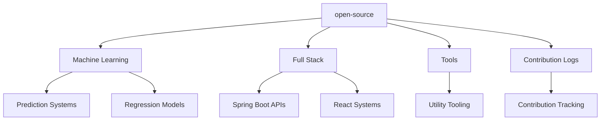
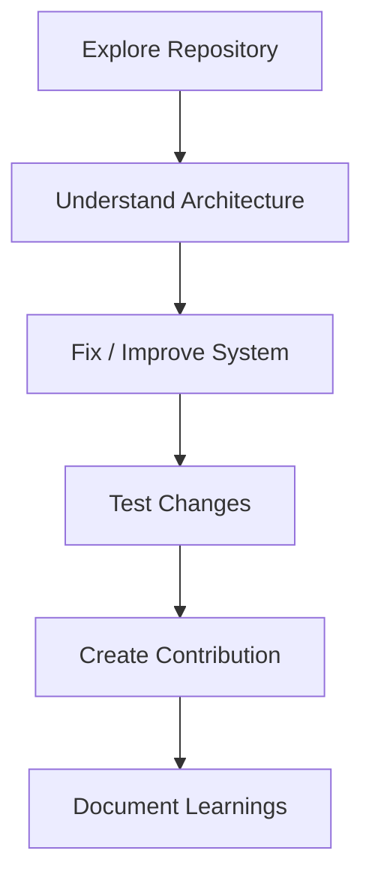

<div align="center">

<br/>

```txt
 ██████╗ ██████╗ ███████╗███╗   ██╗
██╔═══██╗██╔══██╗██╔════╝████╗  ██║
██║   ██║██████╔╝█████╗  ██╔██╗ ██║
██║   ██║██╔═══╝ ██╔══╝  ██║╚██╗██║
╚██████╔╝██║     ███████╗██║ ╚████║
 ╚═════╝ ╚═╝     ╚══════╝╚═╝  ╚═══╝
```

```txt
███████╗ ██████╗ ██╗   ██╗██████╗  ██████╗███████╗
██╔════╝██╔═══██╗██║   ██║██╔══██╗██╔════╝██╔════╝
███████╗██║   ██║██║   ██║██████╔╝██║     █████╗
╚════██║██║   ██║██║   ██║██╔══██╗██║     ██╔══╝
███████║╚██████╔╝╚██████╔╝██║  ██║╚██████╗███████╗
╚══════╝ ╚═════╝  ╚═════╝ ╚═╝  ╚═╝ ╚═════╝╚══════╝
```

### Open Source Engineering & Collaborative Builds

<br/>

[](#)
[](#)
[](#)
[](#)

<br/>

> **Contribute · Collaborate · Improve · Iterate**

> Collection of open source contributions, collaborative engineering projects, ML experimentation, and full stack systems built across multiple domains and technology stacks.

<br/>

[Machine Learning](#-machine-learning-projects) •
[Full Stack](#-full-stack-contributions) •
[Tools](#-developer-tools) •
[Contribution Logs](#-contribution-logs)

---

</div>

# 📘 Overview

> [!NOTE]
> This repository contains open source contributions, collaborative projects, ML experimentation systems, utilities, and engineering logs documenting contribution workflows.

The repository focuses on:

* collaborative engineering
* contribution-based development
* ML experimentation
* deployment workflows
* CI/CD systems
* utility tooling
* production-oriented implementation

---

# 🧠 Engineering Focus

<table>
<tr>

<td width="33%" valign="top">

## 🤖 Machine Learning

* predictive systems
* regression workflows
* model experimentation
* deployment pipelines
* visualization systems
* inference workflows

</td>

<td width="33%" valign="top">

## 🌐 Full Stack Systems

* frontend/backend integration
* collaborative engineering
* Spring Boot systems
* React applications
* scalable architecture
* API workflows

</td>

<td width="33%" valign="top">

## ⚙️ Tooling & DevOps

* CI/CD automation
* GitHub Actions
* deployment workflows
* utility tooling
* AWS deployment
* contribution tracking

</td>

</tr>
</table>

---

# 🤖 Machine Learning Projects

> [!IMPORTANT]
> ML projects focused on predictive systems, experimentation pipelines, deployment workflows, and practical model integration.

---

## 📂 Engineering Domains

<table>
<tr>
<th>Project</th>
<th>Description</th>
<th>Focus Areas</th>
</tr>

<tr>
<td><strong>forest-fire-prediction/</strong></td>
<td>Forest fire prediction system integrating ML workflows with AWS Elastic Beanstalk deployment and GitHub Actions automation.</td>
<td>AWS · CI/CD · Deployment Pipelines</td>
</tr>

<tr>
<td><strong>heart-attack-prediction/</strong></td>
<td>Heart attack risk prediction platform with Flask interface, analytics workflows, and visualization support.</td>
<td>Flask · Visualization · Prediction Systems</td>
</tr>

<tr>
<td><strong>car-price-prediction/</strong></td>
<td>Regression-based car price prediction system with dataset analysis, feature engineering, and model comparison workflows.</td>
<td>Regression · Analytics · ML Experimentation</td>
</tr>

</table>

---

# 🌐 Full Stack Contributions

> [!TIP]
> Collaborative full stack engineering projects involving frontend systems, backend APIs, and scalable application workflows.

---

## 📂 Engineering Domains

<table>
<tr>
<th>Project</th>
<th>Description</th>
<th>Focus Areas</th>
</tr>

<tr>
<td><strong>EduTrack/</strong></td>
<td>Collaborative education tracking system built using Spring Boot and React as part of open source contribution workflows.</td>
<td>Spring Boot · React · APIs</td>
</tr>

</table>

---

# ⚙️ Developer Tools

> [!NOTE]
> Lightweight utilities and productivity-focused engineering tools.

---

## 📂 Engineering Domains

<table>
<tr>
<th>Project</th>
<th>Description</th>
<th>Focus Areas</th>
</tr>

<tr>
<td><strong>thumb-grabber/</strong></td>
<td>YouTube thumbnail extraction utility designed for quick media retrieval workflows.</td>
<td>Utility Tooling · Browser Workflows</td>
</tr>

</table>

---

# 📝 Contribution Logs

> [!TIP]
> Engineering logs documenting contribution workflows, collaboration notes, debugging observations, and open source learning experiences.

---

## 📂 Engineering Domains

<table>
<tr>
<th>Project</th>
<th>Description</th>
<th>Focus Areas</th>
</tr>

<tr>
<td><strong>contribution-log/</strong></td>
<td>Running contribution archive documenting open source participation, repository exploration, and engineering collaboration notes.</td>
<td>Contribution Tracking · Collaboration</td>
</tr>

</table>

---

# 🏗️ Repository Architecture



---

# ⚡ Contribution Workflow



---

# 🧩 Technology Stack

<div align="center">

| Domain               | Technologies                  |
| -------------------- | ----------------------------- |
| **Machine Learning** | Python · scikit-learn · Flask |
| **Full Stack**       | Java · Spring Boot · React    |
| **Cloud & DevOps**   | AWS · GitHub Actions          |
| **Utilities**        | JavaScript · Browser APIs     |
| **Collaboration**    | Git · GitHub Workflows        |

</div>

---

# 📚 Engineering Areas Explored

<div align="center">

<table>
<tr>

<td width="50%" valign="top" align="left">

## 🤖 ML Engineering

* predictive systems
* regression workflows
* feature engineering
* deployment pipelines
* Flask integrations
* analytics visualizations

</td>

<td width="50%" valign="top" align="left">

## 🌐 Open Source Engineering

* collaborative workflows
* contribution systems
* CI/CD automation
* debugging processes
* repository exploration
* scalable integration patterns

</td>

</tr>
</table>

</div>

---

# 🚀 Key Engineering Systems

<table>
<tr>

<td width="50%" valign="top">

## 🔥 Forest Fire Prediction

> ML-powered prediction workflow integrating deployment automation and cloud infrastructure.

### Focus

* AWS deployment
* GitHub Actions
* model deployment
* CI/CD workflows

</td>

<td width="50%" valign="top">

## 🎓 EduTrack

> Collaborative education management system integrating React frontend workflows with Spring Boot backend services.

### Focus

* frontend/backend integration
* API workflows
* collaborative engineering
* scalable architecture

</td>

</tr>
</table>

---

# 🧠 Engineering Principles

> [!TIP]
> Open source work here focuses not only on writing code, but understanding architecture decisions, collaboration workflows, deployment systems, and maintainability.

### Core Principles

* collaborative engineering
* production-oriented thinking
* iterative improvements
* architecture exploration
* deployment awareness
* contribution-driven learning

---

# ⚡ Open Source Philosophy

> [!WARNING]
> Most repositories inside this archive contain:
>
> * contribution experiments
> * collaborative implementations
> * architecture explorations
> * deployment workflows
> * debugging iterations
> * engineering learning trails

---

<div align="center">

<br/>

**Built through open source collaboration and engineering experimentation**

<br/>

*Machine Learning · Full Stack · DevOps · Collaboration*

<br/>

</div>
