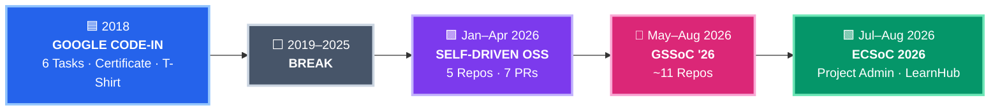
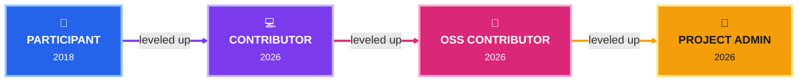

<h1 align="center">Open Source Journey🧑‍💻</h1>

  

  
  
  
  
  

  
  
  
  
  
  

## 🎯 Milestones

<table align="center">
  <thead>
    <tr>
      <th>🗓️ Period</th>
      <th>🚀 Program</th>
      <th>🎯 Role</th>
      <th>📍 Status</th>
    </tr>
  </thead>
  <tbody>
    <tr>
      <td align="center"><b>Oct–Dec 2018</b></td>
      <td align="center">🟦 <b>Google Code-in</b></td>
      <td align="center">🌱 Participant</td>
      <td align="center"></td>
    </tr>
    <tr>
      <td align="center"><b>2019–2025</b></td>
      <td align="center">⚪ <b>Break</b></td>
      <td align="center">💤 —</td>
      <td align="center"></td>
    </tr>
    <tr>
      <td align="center"><b>Jan–Apr 2026</b></td>
      <td align="center">🟪 <b>Self-Driven OSS</b></td>
      <td align="center">💻 Contributor</td>
      <td align="center"></td>
    </tr>
    <tr>
      <td align="center"><b>May 15–Aug 15 2026</b></td>
      <td align="center">🩷 <b>GSSoC '26</b></td>
      <td align="center">🤝 Contributor</td>
      <td align="center"></td>
    </tr>
    <tr>
      <td align="center"><b>Jul–Aug 31 2026</b></td>
      <td align="center">🟩 <b>ECSoC 2026</b></td>
      <td align="center">👑 Project Admin · LearnHub</td>
      <td align="center"></td>
    </tr>
  </tbody>
</table>

## 🧗 Role Progression

## 🔥 Self-Driven Contribution's PRs

<table align="center">
  <thead>
    <tr>
      <th>📦 Repository</th>
      <th>🔗 Pull Requests</th>
    </tr>
  </thead>
  <tbody>
    <tr>
      <td>
        <a href="https://github.com/sudoSami/thumb-grabber"><b>sudoSami/thumb-grabber</b></a>
      </td>
      <td>
        
        
      </td>
    </tr>
    <tr>
      <td>
        <a href="https://github.com/shubhmrj/Predict-forest-fire"><b>shubhmrj/Predict-forest-fire</b></a>
      </td>
      <td>
        
      </td>
    </tr>
    <tr>
      <td>
        <a href="https://github.com/aditya8242/EduTrack"><b>aditya8242/EduTrack</b></a>
      </td>
      <td>
        
      </td>
    </tr>
    <tr>
      <td>
        <a href="https://github.com/shubhmrj/Heart_Attack_Prediction"><b>shubhmrj/Heart_Attack_Prediction</b></a>
      </td>
      <td>
        
      </td>
    </tr>
    <tr>
      <td>
        <a href="https://github.com/shubhmrj/car-price-prediction"><b>shubhmrj/car-price-prediction</b></a>
      </td>
      <td>
        
        
      </td>
    </tr>
  </tbody>
</table>

## 🔗 Profiles

<table align="center">
  <tr>
    <td align="center">
      <b>🩷 GSSoC '26</b> 
      Contributor  
  
    
  
</td>

<td width="80"></td>

<td align="center">
  <b>🟩 ECSoC 2026</b> 
  Project Admin · <a href="https://github.com/udaycodespace/learnhub">LearnHub</a>  
  
    
  
</td>
  </tr>
</table>

  
  
  
  

