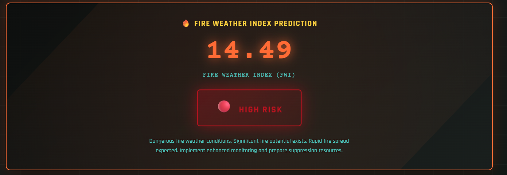

# Frontend contribution with defined scope.
# Original repository credited; this fork tracks my changes.

# Algerian Forest Fire Prediction

**Predicting the Fire Weather Index (FWI) using meteorological data with a Flask-based web interface.**

<p align="center">
  <a href="#tech-stack">
    
    
    
    
    
    
  </a>
</p>

---

## Table of Contents
- [Project Overview](#project-overview)
- [Features](#features)
- [Tech Stack](#tech-stack)
- [Directory Structure](#directory-structure)
- [Installation](#installation)
- [Usage](#usage)
- [Workflow](#workflow)
- [Model Training and Evaluation](#model-training-and-evaluation)
- [Dataset](#dataset)
- [Future Improvements](#future-improvements)
- [Contributing](#contributing)
- [License](#license)
- [Credits](#credits)

---

## Project Overview

This project demonstrates an end-to-end machine learning solution for predicting the Fire Weather Index (FWI) based on the Algerian Forest Fires dataset from 2012. The primary goal is to provide a reliable prediction of fire risk, which is then served through an intuitive web UI built with Flask. The FWI is a key indicator of fire danger, and this tool helps in assessing the risk level by mapping the predicted FWI to a clear risk band.

### Demo

<p align="center">
  
  
  
</p>

---

## Features

- **FWI Prediction**: Utilizes a Ridge Regression model to predict the Fire Weather Index.
- **Modern UI**: A user-friendly interface with client-side validation for a seamless experience.
- **Risk Assessment**: Translates the FWI prediction into an easy-to-understand risk level (Low, Moderate, High, Extreme).
- **Interactive Notebooks**: Includes Jupyter notebooks for exploratory data analysis and model training.

---

## Tech Stack

- **Python**: Core programming language.
- **Flask**: Web framework for the user interface.
- **Scikit-learn**: For machine learning model development.
- **NumPy & Pandas**: For data manipulation and analysis.

---

## Directory Structure

<details>
<summary>Click to expand</summary>

```
Predict-Forest-Fire/
├── application.py
├── requirement.txt
├── README.md
├── Datasets/
│   ├── Algerian_forest_fires_dataset.csv
│   └── algerian_forst_fires_updated_datatset.csv
├── Models/
│   ├── ridge.pkl
│   └── scaler.pkl
├── Notebooks/
│   ├── EDA_and_FeatueEngineering.ipynb
│   └── model_training.ipynb
├── templates/
│   ├── index.html
│   └── home.html
└── docs/
    ├── cost_function.png
    ├── Screenshot 2026-01-02 224015.png
    ├── Screenshot 2026-01-02 224158.png
    └── image.png
```

</details>

---

## Installation

1. **Clone the repository:**
   ```bash
   git clone https://github.com/your-username/Predict-Forest-Fire.git
   cd Predict-Forest-Fire
   ```

2. **Create and activate a virtual environment:**
   ```bash
   python -m venv .venv
   source .venv/bin/activate  # On Windows, use `.venv\Scripts\activate`
   ```

3. **Install the dependencies:**
   ```bash
   pip install -r requirement.txt
   ```

---

## Usage

1. **Run the Flask application:**
   ```bash
   python application.py
   ```

2. **Access the UI:**
   Open your browser and go to `http://localhost:5000`.

3. **Get a Prediction:**
   - Click **Launch System**.
   - Fill in the required values and submit the form to see the FWI prediction and risk level.

---

## Workflow


---

## Model Training and Evaluation

The model is trained in the `Notebooks/model_training.ipynb` notebook. The process includes data cleaning, feature engineering, and model selection. The final model, a Ridge Regressor, was chosen for its balance of accuracy and regularization.

### Evaluation Results

<details>
<summary>Click to expand</summary>

| Model               | MAE    | R²     |
|---------------------|--------|--------|
| Linear Regression   | 0.5468 | 0.9848 |
| Lasso               | 1.1332 | 0.9492 |
| Ridge Regression    | 0.5642 | 0.9843 |
| ElasticNet          | 1.8822 | 0.8753 |

</details>

---

## Dataset

The project uses the **Algerian Forest Fires Dataset (2012)**, which contains 244 instances with 11 attributes. The data covers the period from June to September 2012 for two regions: Bejaia and Sidi Bel-abbes.

### Features Used for Training

- `Temperature`
- `RH` (Relative Humidity)
- `Ws` (Wind speed)
- `Rain`
- `FFMC` (Fine Fuel Moisture Code)
- `DMC` (Duff Moisture Code)
- `ISI` (Initial Spread Index)
- `Classes` (Encoded fire/not fire)
- `Region` (Encoded Bejaia/Sidi Bel-abbes)

---

## Future Improvements

- **JSON API**: Implement a RESTful API for programmatic predictions.
- **Real-time Charts**: Add dynamic charts for better risk visualization.
- **CI/CD**: Integrate continuous integration and deployment pipelines.
- **Experiment Tracking**: Use tools like MLflow for experiment management.

---

## Contributing

Contributions are welcome! Please feel free to submit a pull request or open an issue if you have any suggestions or find any bugs.

---

## License

This project is open-source. See the `LICENSE` file for more details.

---

## Credits

- **Frontend/UI**: [udaycodespace](https://github.com/udaycodespace)
- **Backend & ML**: [shubhmrj](https://github.com/shubhmrj)
