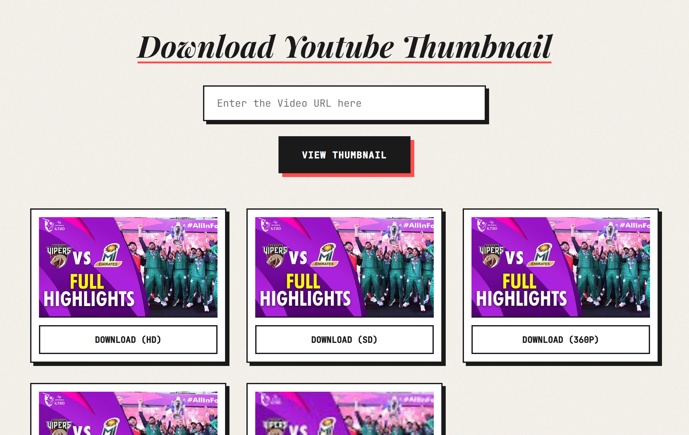

# Thumb Grabber

Simple web tool to download YouTube video thumbnails. Built with HTML, CSS and vanilla JavaScript, no backend, no auth, no tracking.

## Usage
1. Go to [live link](https://sudosami.github.io/thumb-grabber/)
2. Paste a YouTube link.  
3. Click **View Thumbnail**.  
4. Click **Download** on the size you want.

## Preview
